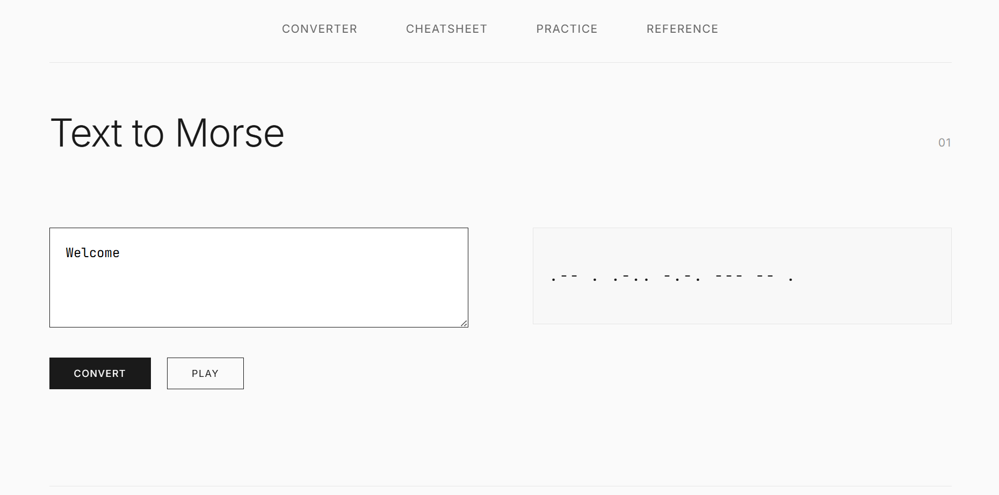
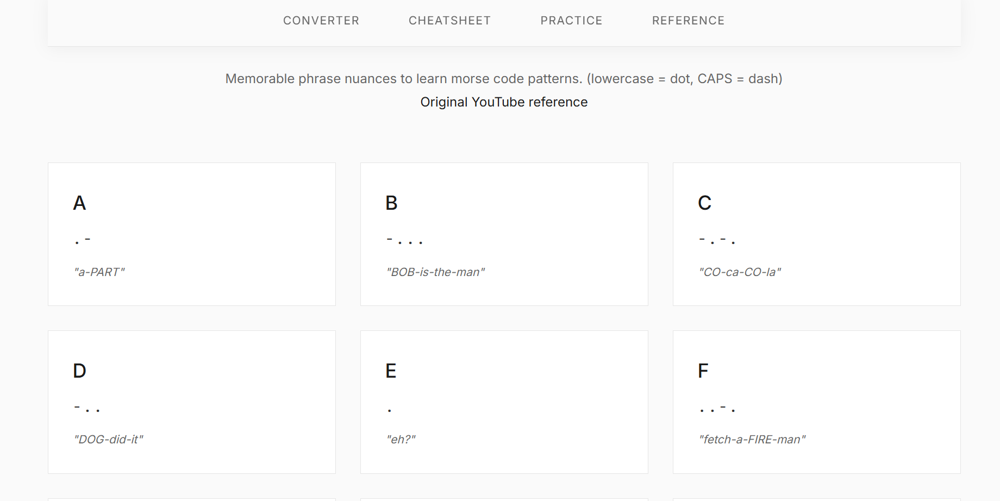
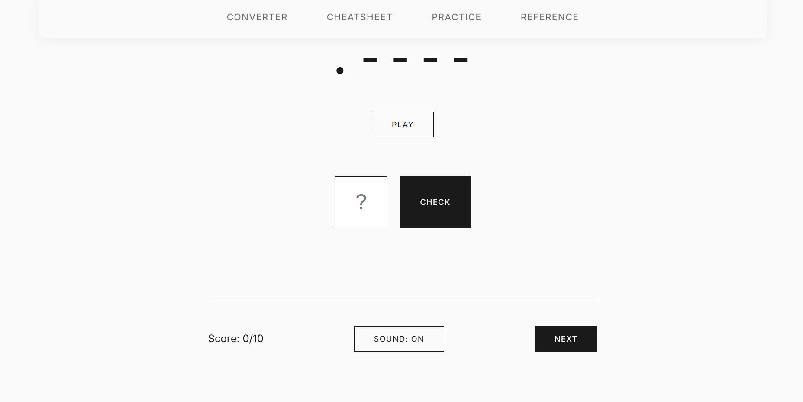
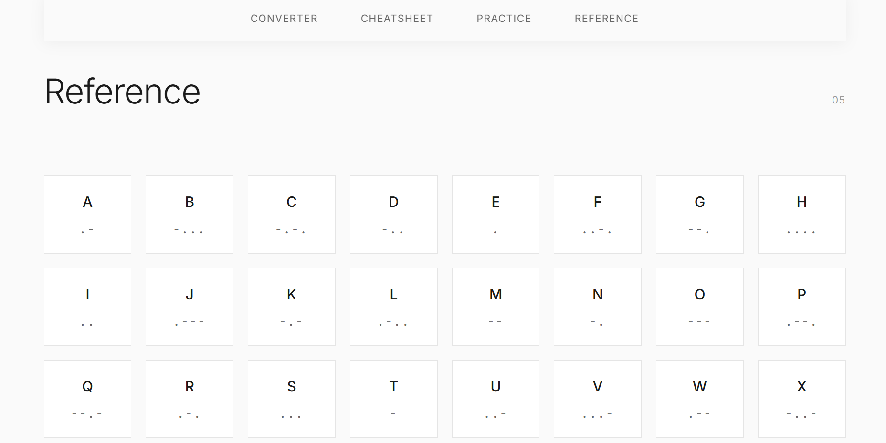

# 🎯 Morse Warriorz

A minimalist morse code learning platform with interactive converters, memorable phrases, and practice exercises.

## 💡 Why This Exists

- This project was born from a spontaneous moment of curiosity - one day I suddenly had the urge to learn Morse code just to pass time. Then i straight went to youtube to check about morse code and one of the video I watched, I used it as a refernce to create a section in the website. 
- Instead of using existing tools, I decided to create my own website with an intuitive, fun, and easy-to-use interface. The goal was to build something I could always refer back to for anything Morse code related, while making the learning experience enjoyable and accessible.

## 🚀 What It Does

This website helps you learn morse code through multiple interactive tools:
- Convert text to morse code and vice versa
- Listen to morse code audio with authentic dot and dash sounds
- Learn letters A-Z using memorable phrases (e.g., "a PART" for A = •—)
- Practice with letter/number quizzes
- Reference complete morse code alphabet with audio

## ✨ Features

- **Text ↔ Morse Converter** - Real-time conversion between text and morse code
- **Audio Playback** - Hear morse code with Web Audio API generated sounds
- **Memory Cheatsheet** - Memorable phrases for each letter (lowercase = dot, UPPERCASE = dash)
- **Practice Quiz** - Interactive exercises to test your knowledge
- **Reference Chart** - Complete alphabet and numbers with clickable audio
- **Smooth Navigation** - Sticky navbar with smooth scrolling between sections

## 🛠️ Tech Stack

- **Frontend**: HTML5, CSS3, JavaScript
- **Audio**: Web Audio API for Morse code sounds
- **Styling**: Modern CSS with responsive design

## 📦 Installation & Setup

### Quick Start
1. Clone the repository:
   ```bash
   git clone https://github.com/kayspace/morse-warriorz.git
   ```

2. Navigate to the project directory:
   ```bash
   cd morse-warriorz
   ```

3. Open `index.html` in your web browser:
   ```bash
   # On macOS
   open index.html
   
   # On Windows
   start index.html
   
   # On Linux
   xdg-open index.html
   ```

### Local Server (Optional)
For development, you can run a local server:

```bash
# Using Python 3
python -m http.server 8000

# Using Node.js
npx http-server

# Then visit http://localhost:8000
```

## 🚀 How to Use

1. **Converter**: Type text to see morse code, or input morse code to see text
2. **Audio**: Click play buttons to hear morse code sounds
3. **Memory Aid**: Use memorable phrases to learn each letter pattern
4. **Quiz**: Practice identifying letters and numbers
5. **Reference**: Click any morse code in the chart to hear it aloud

## 🎯 Navigation

The app features smooth scrolling navigation between sections:
- **Home**: Welcome and introduction
- **Converter**: Text ↔ Morse code conversion
- **Memory**: Learn with memorable phrases
- **Quiz**: Practice exercises
- **Reference**: Complete morse code chart

## 📸 Application Interface Screenshots

<!-- Add screenshots here - see instructions below -->

*Main converter interface with text input and morse output*

  
*Memorable phrases section for learning letters*


*Interactive quiz for testing knowledge*


*Aplhabets and Numbers Reference*

## 🤝 Contributing

We welcome contributions! Please see our [Contributing Guidelines](CONTRIBUTING.md) for detailed information on how to get started.

Quick ideas for contributions:
- Add more memorable phrases for better learning
- Improve quiz functionality with scoring
- Add speed/timing challenges
- Better mobile responsiveness
- Dark/light theme toggle

## 🐛 Bug Reports

Found a bug? Please create an issue with:
- Clear description of the problem
- Steps to reproduce
- Expected vs actual behavior
- Browser/device information
- Screenshots (if applicable)

## 📚 Learn More About Morse Code

- [International Morse Code](https://en.wikipedia.org/wiki/Morse_code)
- [Morse Code Learning Resources](https://morsecode.world/international/morse2.html)
- [Amateur Radio Morse Code](https://www.arrl.org/learning-morse-code)

## 📄 License

This project is licensed under the MIT License - see the [LICENSE](LICENSE) file for details.

## 👨‍💻 Author

**Kay Space** - [GitHub Profile](https://github.com/kayspace)

## ⭐ Show Your Support

If you found this project helpful, please give it a star! It helps others discover the project.

## 🙏 Acknowledgments

- Thanks to all contributors who help improve this project
- Inspired by the need to make Morse code learning fun and accessible
- Built with passion for education and interactive learning

---

**Happy Learning! 📻 ·-· ·-· ·-· ·-·**